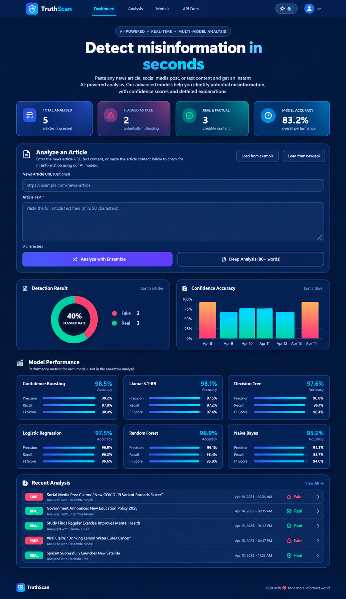

# Fake News Detector


## Dashboard Preview


An ultra-fast, production-grade Fake News Detection API leveraging a 5-model Machine Learning ensemble and spaCy NLP preprocessing.

---

## Features

| Feature | Description |
|---------|-------------|
| **5 ML Model Ensemble** | Combines Logistic Regression, Decision Tree, Gradient Boosting, Naive Bayes, and Linear SVC for average calibrated probability-based prediction. |
| **spaCy NLP Pipeline** | Fast, production-ready natural language processing (`en_core_web_sm`). |
| **Rate Limiting** | Protected with SlowAPI — 10 requests/minute per IP on analysis endpoint. |
| **Input Validation** | Strict length and whitespace sanitization using Pydantic V2 validators. |
| **Structured Logging** | Clean, asynchronous, and rotating logs using Loguru. |
| **CI/CD** | Automated testing via GitHub Actions. |
| **Docker Support** | Fully containerized for easy scaling and deployment. |
| **REST API** | 5 specialized endpoints for health checks, model metadata, metrics, and text analysis. |
| **Live deployment on Render** | Fully hosted and accessible online. |
| **DistilBERT Deep Analysis** | Fine-tuned DistilBERT on 44K articles achieving 99.97% accuracy, hosted on Hugging Face (Note: external model, not yet locally reproduced). |

---

## Tech Stack

- **Backend Framework**: FastAPI (with Uvicorn & Gunicorn)
- **Machine Learning**: scikit-learn
- **NLP Preprocessing**: spaCy (`en_core_web_sm`)
- **Data Handling**: pandas, numpy
- **Rate Limiting**: slowapi
- **Validation**: Pydantic Settings
- **Testing**: pytest, httpx
- **Logging**: Loguru
- **Transformer Model**: HuggingFace DistilBERT (fine-tuned)
- **Model Hub**: Hugging Face — GuptaAshutosh/truthscan-fake-news-distilbert

---

## Project Structure

```text
.
├── .github/
│   └── workflows/
│       └── ci.yml
├── data/
│   ├── Fake.csv
│   └── True.csv
├── frontend/
│   ├── app.js
│   ├── index.html
│   └── style.css
├── models/
│   └── calibrated/
│       ├── dt_calibrated.pkl
│       ├── gbc_calibrated.pkl
│       ├── lr_calibrated.pkl
│       ├── nb_calibrated.pkl
│       ├── svc_calibrated.pkl
│       └── vectorizer.pkl
├── routers/
│   └── api.py
├── tests/
│   ├── __init__.py
│   ├── test_api.py
│   └── test_nasa.py
├── .dockerignore
├── .env
├── .gitignore
├── app.py
├── config.py
├── distilbert_predictor.py
├── Dockerfile
├── download_data.py
├── download_models.py
├── predictor.py
├── preprocessor.py
├── README.md
├── render.yaml
├── requirements.txt
└── train.py
```

---

## Local Setup

**1. Clone repo**
```bash
git clone https://github.com/ashutosh8950/fake-news-detector.git
cd fake-news-detector
```

**2. Install dependencies**
```bash
pip install -r requirements.txt
```

**3. Download spaCy model**
```bash
python -m spacy download en_core_web_sm
```

**4. Download data and train models**
```bash
python download_data.py
python train.py
```

**5. Run server**
```bash
python app.py
```

---

## Docker Instructions

**1. Build image**
```bash
docker build -t fake-news-detector .
```

**2. Run container**
```bash
docker run -p 8000:8000 fake-news-detector
```

---

## Run Tests

Run the full pytest suite (no server needed):
```bash
python -m pytest -v tests/
```

---

## API Endpoints

### 1. Health Check
`GET /health`

**Response Example**
```json
{
  "status": "ok",
  "models_loaded": true,
  "uptime_seconds": 45.2
}
```

### 2. Models Info
`GET /models/info`

**Response Example**
```json
{
  "gbc": {
    "name": "Gradient Boosting",
    "accuracy": 98.5,
    "precision": 98.52,
    "recall": 98.5,
    "f1": 98.51
  },
  "lr": {
    "name": "Logistic Regression",
    "accuracy": 97.53,
    "precision": 97.53,
    "recall": 97.53,
    "f1": 97.53
  }
}
```

### 3. Analyze News
`POST /analyze`

**Request Example**
```json
{
  "title": "Local Man Discovers Infinite Energy",
  "text": "A local scientist has completely defied the laws of thermodynamics in his garage..."
}
```

**Response Example**
```json
{
  "predictions": {
    "Logistic Regression": "Fake",
    "Decision Tree": "Fake",
    "Gradient Boosting": "Fake",
    "Naive Bayes": "Fake",
    "Linear SVC": "Fake"
  },
  "ensemble_label": "Fake",
  "overall_confidence": 100.0,
  "processing_time_ms": 12.4
}
```

### 4. Deep Analyze (DistilBERT)
`POST /analyze/deep`
Rate limit: 5 requests/minute

**Request Example**
```json
{
  "title": "Local Man Discovers Infinite Energy",
  "text": "A local scientist has completely defied the laws of thermodynamics..."
}
```

**Response Example**
```json
{
  "label": "FAKE",
  "confidence": 97.9,
  "processing_time_ms": 245.3
}
```

### 5. Metrics
`GET /metrics`

Returns API usage statistics and health metrics. Note: These metrics are process-local and will reset upon application restart.

**Response Example**
```json
{
  "total_requests": 150,
  "fake_detected": 85,
  "real_detected": 65,
  "avg_confidence": 94.5,
  "uptime_seconds": 3600.5,
  "models_loaded": true,
  "api_version": "2.0.0"
}
```

---

## Model Accuracy

| Model | Accuracy | Precision | Recall | F1 Score |
|-------|----------|-----------|--------|----------|
| **Gradient Boosting** | 98.50% | 98.52% | 98.50% | 98.51% |
| **Linear SVC** | 98.06% | 98.06% | 98.06% | 98.06% |
| **Decision Tree** | 97.60% | 97.60% | 97.60% | 97.60% |
| **Logistic Regression**| 97.53% | 97.53% | 97.53% | 97.53% |
| **Naive Bayes** | 95.17% | 95.18% | 95.17% | 95.17% |

---

## AI Models

## Known Limitations

Classifier accuracy is measured on the training distribution's dominant topics; performance on underrepresented topics (e.g., science/space news) has not been separately validated and may be less reliable.

The production ensemble uses five models. Random Forest was removed because its calibrated artifact caused memory issues on constrained deployment environments; the five-model ensemble performs equal or better on the held-out evaluation.

| Model | Type | Accuracy | Hosted |
|---|---|---|---|
| Ensemble (5 models) | TF-IDF + scikit-learn | 98.4396% | Local |
| DistilBERT | Fine-tuned Transformer | 99.97%* | Hugging Face |

*Measured via 5-fold CV + held-out evaluation with a leakage audit on September 16, 2026.
\**External model, not yet locally reproduced.*

Hugging Face Model: https://huggingface.co/GuptaAshutosh/truthscan-fake-news-distilbert

---

## Live Demo

Test the application live: [https://truthscan-fake-news-detector.onrender.com](https://truthscan-fake-news-detector.onrender.com)
